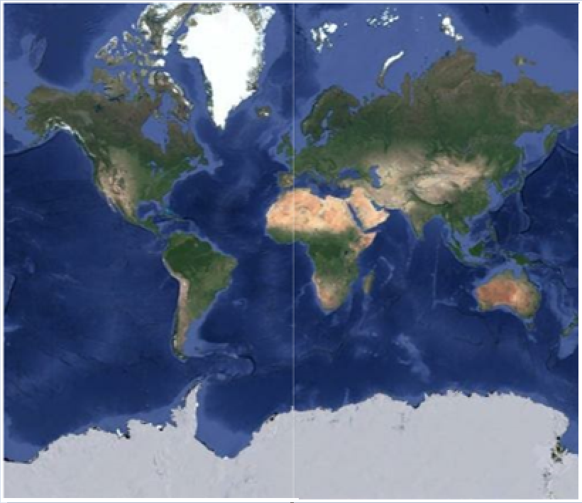

# How-to-show-google-map-in-WPF-SfMap
	
This article explains  how to use google maps API to show that in Syncfusion WPF Maps control as shown in below.

 

## Display the Google Maps

You can show the Google Maps by overriding the Imagery layer as given in the below code snippet. 

**[XAML]**
```

          <sync:SfMap>
            <sync:SfMap.Layers>
                <local:ImageryLayerExt>
                </local:ImageryLayerExt>
            </sync:SfMap.Layers>
        </sync:SfMap>
```
**[C#]**
```
    public class ImageryLayerExt : ImageryLayer
    {
        protected override string GetUri(int X, int Y, int Scale)
        {
            var link = "http://mt1.google.com/vt/lyrs=y&x=" + X.ToString() + "&y=" + Y.ToString() + "&z=" + Scale.ToString();
            return link;
        }
    } 
```

KB article - [How-to-show-google-map-in-WPF-SfMap](https://www.syncfusion.com/kb/11928/how-to-show-google-map-in-wpf-map-sfmap)

## See also

[How to view bing map using WPF SfMap](https://www.syncfusion.com/kb/10799/how-to-view-bing-map-using-wpf-map-control-sfmap)

[How to open street map in WPF SfMap](https://help.syncfusion.com/wpf/maps/map-providers#open-street-map)

[How to add a multiple layers in OSM map](https://help.syncfusion.com/wpf/maps/map-providers#adding-a-multiple-layers-in-osm)

[How to show the markers in WPF SfMap](https://help.syncfusion.com/wpf/maps/markers)


